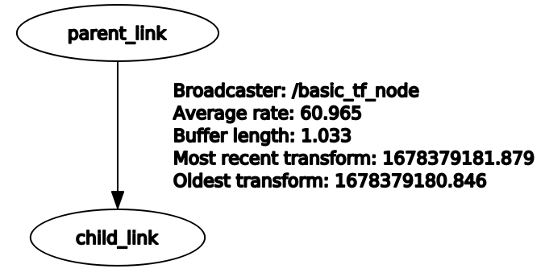
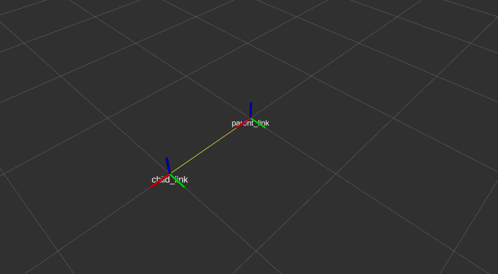

# basic_tf_tutorial

basic_tf_tutorial provides a reference to a simple ROS TF

### Run

```bash
rosrun basic_tf_tutorial basic_tf_node.launch
```

### rqt_tf_tree

Check tf_tree by entering the command below

```bash
rosrun rqt_tf_tree rqt_tf_tree
```




### Rviz

Check tf_tree by entering the command below

```bash
rviz
```


