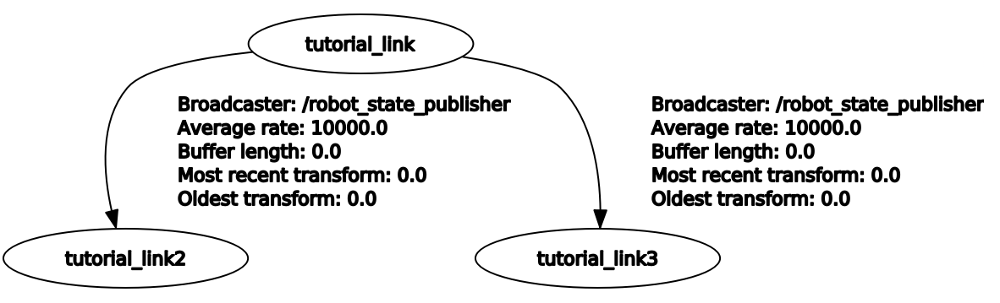
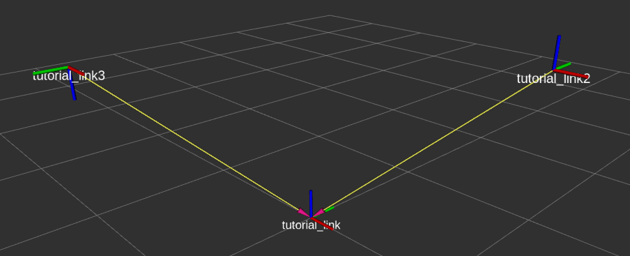

# basic_urdf_tutorial

basic_urdf_tutorial provides a reference to a simple ROS urdf

### Run

```bash
roslaunch basic_urdf_tutorial urdf_tutorial.launch
```

### rqt_tf_tree

Check tf_tree by entering the command below

```bash
rosrun rqt_tf_tree rqt_tf_tree
```




### Rviz

Check tf_tree by entering the command below

```bash
rviz
```




-----

For more information on how to write A, please refer to the link below

- [urdf Tutorial](http://wiki.ros.org/urdf/Tutorials)
